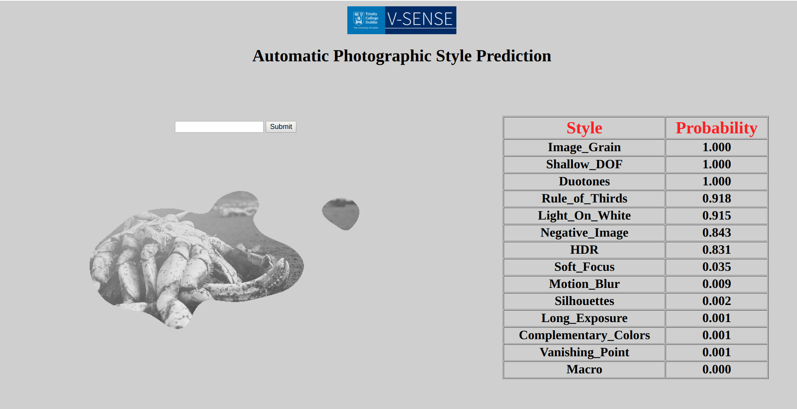

 
 # A Geometry-Sensitive Approach for Photographic Style Classification
 ### Koustav Ghosal, Mukta Prasad, Aljosa Smolic 
 ### IMVIP 2018
 
## Prerequisites
```
Ubuntu (14 or higher)
Cuda 9
python 2.7
```
## Installing python libraries
```pip install -r requirements.txt```


## Data and Pretrained models
For faster training, we have extracted the saliency maps using [1] and appended them with the RGB images as RGBA PILs. 
* RGB  
* RGB + Saliency
* Pretrained Models
[Download Link](https://drive.google.com/file/d/1TtiZvHhfBtFbT7PuwHEqRP1UFGhCdi_d/view?usp=sharing)

## Running the scripts
### Features 
* One can train both single and double column architectures using this code. 
* Testing is optional. One can try only training for different data augmentation and network architectures.
* A web based GUI is provided which can be used to observe the performance for a single image

### Only Training

Training a double column CNN
```
python -W ignore CNN_Master.py --datapath /root/directory/containing/train/val/subdirectories/ --model DenseNet_Saliency_Direct --save /path/for/saving/models/ --pooling --pretrained --aug_train SAL_ICC --batch_size 8
```

Training a single column CNN
```
python -W ignore CNN_Master.py --datapath /root/directory/containing/train/val/subdirectories/ --model DenseNet_161 --save /path/for/saving/models/ --pooling --pretrained --aug_train ICC --batch_size 8
```

Check CNN_Master.py for the full list of command line options, models, augmentation strategies

### Both training and testing

For double column
```
python -W ignore CNN_Master.py --datapath /root/directory/containing/train/val/subdirectories/ --model DenseNet_Saliency_Direct --save /path/for/saving/models/ --pooling --pretrained --aug_train SAL_ICC --batch_size 8 --withTesting --aug_test SAL_ICC --testDataPath /path/to/test/data --testLabels /path/to/test/data/test.multilab --testIds /path/to/test/data/test.jpgl
```
For single column
```
python -W ignore CNN_Master.py --datapath /root/directory/containing/train/val/subdirectories/ --model DenseNet_161 --save /path/for/saving/models/ --pooling --pretrained --aug_train ICC --batch_size 8 --withTesting --aug_test ICC --testDataPath /path/to/test/data --testLabels /path/to/test/data/test.multilab --testIds /path/to/test/data/test.jpgl
```
### Important

Make sure you use a SAL_ prefix for augmentation for the double column model. For a single column remove the SAL_ prefix. 

## GUI
This GUI can be used to observe predictions on single image from the web or local directories.

### Testing RGB images with single column methods

```
cd GUI
python Master.py /path/to/model/xyz.model ICC

```
### Testing RGB-Saliency images with double column methods

```
cd GUI
python Master.py /path/to/model/xyz.model SAL_ICC

```
### Final Step
Open browser and go to 0.0.0.0:3134. 

For images from the web just paste the raw link of the image. For example, 
```
https://pbs.twimg.com/profile_images/969919433820041216/lx_WkhmQ_200x200.jpg
```
For local images, paste the location followed by file://. For example,
```
file:///home/path/to/image/XYZ.jpg
```

Press submit. If everything works one should observe something as follows. 


### Single Column Output

### Double Column Output


### Important

Make sure you use a SAL_ prefix for augmentation and use a 4-channel image for the double column model. For a single column remove the SAL_ prefix and use it on a RGB image. 

## Contact
ghosalk@tcd.ie

## Referneces
1.  Cornia, M., Baraldi, L., Serra, G., and Cucchiara, R. (2016). Predicting human eye fixations via an lstm-based
saliency attentive model. arXiv preprint arXiv:1611.09571


